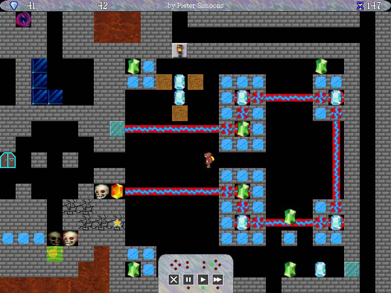

## Summary

This project is one of my favorites, I want to make an open-source clone of the original [SubTerra](http://crystalshard.net/old/cs_curvy.php?p=6), made by Crystal Shard.

**Disclaimer**  
Now I don't want to be a competitor to the company, I'm just making a kind of fan game because of the love I have for the original game.  
If you are interested, you can play the original game (and its successor SubTerra 2), they are free.  
To support the developers, you can also buy the new sequel, [Sub Terra Draconis](http://crystalshard.net/?g=2).

Here's a screenshot of the original game:

